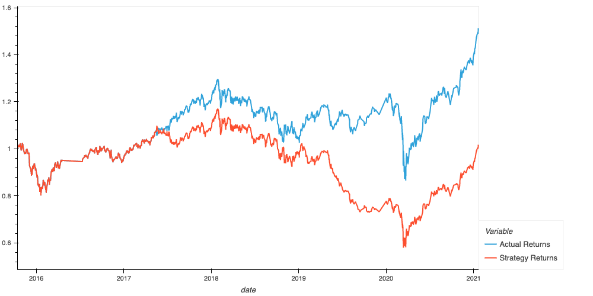

# Algorithmic Trading Bot
---

--------------------------------
## Description
This application is contains two machine learning algorithms used to analyze to automate the trade decisions, adjusting input parameters to optimize the trade, and in the end compare both trading algorithms performances.

-------

## Baseline Trading

As we can see the original trading strategy, we can see that there is a high returns and a good option to use this as a trading algorithm.

## Option 1 (SVC Classifier)

This is representation of an increased SMA Windows. As we can see giving it a wider range in windows there is a decrease in returns.

Giving the algorithm a longer timestamp to analyze it came to the conclusion that the best option is the baseline trading.

---

## Option 2 (AdaBoost Classifier)

This is the original plot of the second algorithm trading option. Even though compared to the first algorithm plot there is a higher return.

---

This is representation of an increased SMA Windows. As we can see giving it a wider range in windows there is a extreme decrease in returns.

Giving the algorithm a longer timestamp to analyze it will give both a return and a loss, but in the end there was a slight return.

--------------------------------

## Contributors

Brought to you by Angel Reyes.
